# 🔍 PaySim Fraud Analytics Platform

> **Production-grade, end-to-end fraud analytics pipeline built on the modern data stack.**  
> PaySim synthetic transactions → GCS → PySpark → Snowflake → dbt → Airflow


---

## 📋 Table of Contents

- [Business Problem](#-business-problem)
- [Architecture](#-architecture)
- [Tech Stack](#-tech-stack)
- [Data Pipeline](#-data-pipeline)
  - [1. Landing — Batch Upload to GCS](#1-landing--batch-upload-to-gcs)
  - [2. Raw — PySpark Ingestion to Snowflake](#2-raw--pyspark-ingestion-to-snowflake)
  - [3. Staging — dbt Cleaning & Typing](#3-staging--dbt-cleaning--typing)
  - [4. Trusted — dbt Dimensional Model](#4-trusted--dbt-dimensional-model)
- [Data Model](#-data-model)
- [Orchestration](#-orchestration)
- [Data Quality](#-data-quality)
- [Infrastructure](#-infrastructure)
- [Project Structure](#-project-structure)
- [How to Run Locally](#-how-to-run-locally)
- [Design Decisions](#-design-decisions)
- [Roadmap](#-roadmap)

---

## 💡 Business Problem

Financial fraud costs the global economy hundreds of billions of dollars annually. This platform simulates a **real-world fraud detection data pipeline** using the [PaySim dataset](https://www.kaggle.com/datasets/ealaxi/paysim1) — a synthetic mobile money transaction log with **6.3 million rows** across 31 CSV batches.

The platform answers operational questions like:

- 📈 How many fraudulent transactions occurred per time window?
- 💰 What is the total monetary value of fraud events by transaction type?
- 🧾 Which accounts are involved in suspicious patterns?
- 🔬 What is the precision of the fraud flag (true positives vs. false positives)?

---

## 🏗 Architecture

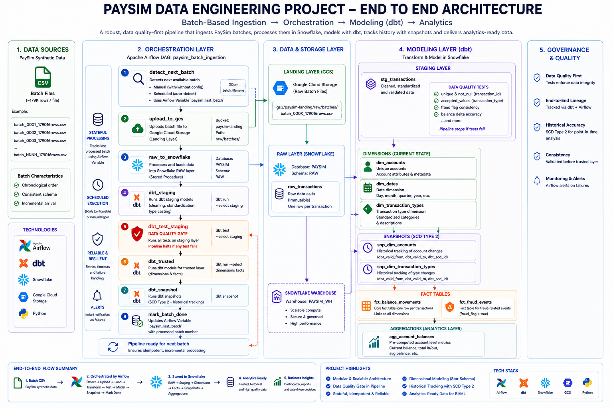

The platform follows a **medallion architecture** pattern across four layers:

```
Local CSV Batches
      │
      ▼
GCS Landing Zone  (incoming/ → processed/ | error/)
      │
      ▼  [PySpark + Snowflake Spark Connector]
Snowflake RAW Schema
      │
      ▼  [dbt — incremental merge]
Snowflake STAGING Schema   ← stg_transactions
      │
      ▼  [dbt — table materialization]
Snowflake TRUSTED Schema   ← dim_accounts | dim_dates | dim_transaction_types
                           ← fct_fraud_events | fct_balance_movements | agg_account_balances
      │
      ▼  [dbt snapshots — SCD Type 2]
Snowflake SNAPSHOTS Schema ← dim_accounts_snapshot | dim_transaction_types_snapshot
```

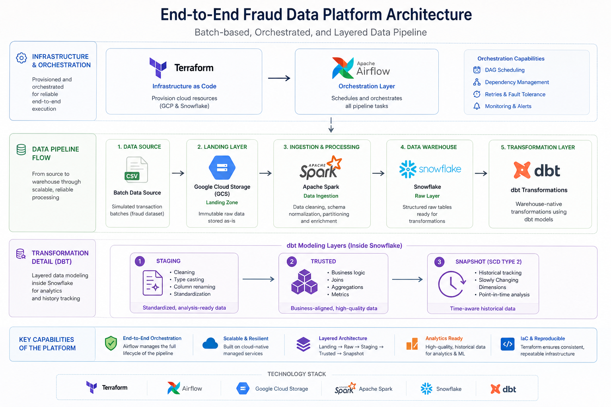

---

## 🛠 Tech Stack

| Layer | Technology | Purpose |
|---|---|---|
| **Source Data** | PaySim CSV (6.3M rows, 31 batches) | Synthetic fraud transaction dataset |
| **Cloud Storage** | Google Cloud Storage (GCS) | Landing zone for raw batch files |
| **Ingestion** | PySpark + Snowflake Spark Connector | Distributed read from GCS, append to Snowflake |
| **Data Warehouse** | Snowflake | Multi-schema analytical warehouse |
| **Transformation** | dbt Core | SQL transformations, tests, documentation |
| **Orchestration** | Apache Airflow (Astronomer Runtime) | DAG scheduling, state tracking, retries |
| **Infrastructure** | Terraform | IaC for GCS buckets & service accounts |
| **CI/CD** | GitHub Actions (planned) | dbt compile, lint, test on every push |
| **Language** | Python 3.11 | Ingestion jobs, Airflow operators |
| **Code Quality** | Ruff | Linting & formatting |

---

## 🔄 Data Pipeline
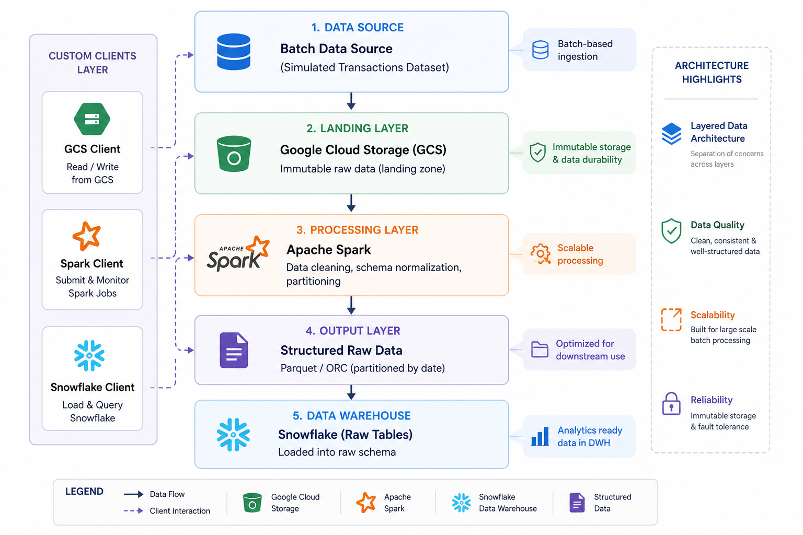

### 1. Landing — Batch Upload to GCS


Each PaySim batch CSV is uploaded from local disk to **GCS `landing/incoming/paysim/`** before any processing begins.

```
dataset/batches_output/batch_NNNN_XXXXXXrows.csv
              │
              ▼  [upload_batch_to_gcs.py]
gs://<bucket>/landing/incoming/paysim/batch_NNNN_XXXXXXrows.csv
```

Bad files are routed to `landing/error/` automatically via Spark's `badRecordsPath` option.

---

### 2. Raw — PySpark Ingestion to Snowflake

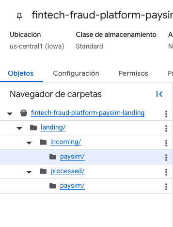

`GCPDataReader` (PySpark) reads all CSV files from `landing/incoming/`, enforces the schema defined in `DataParameters`, appends rows to `FRAUD_DB.RAW.raw_transactions` in Snowflake, and moves processed files to `landing/processed/`.

Key metadata columns added at this stage:
- `_raw_ingestion_timestamp` — time the row landed in Snowflake
- `_ingestion_date` — partition date

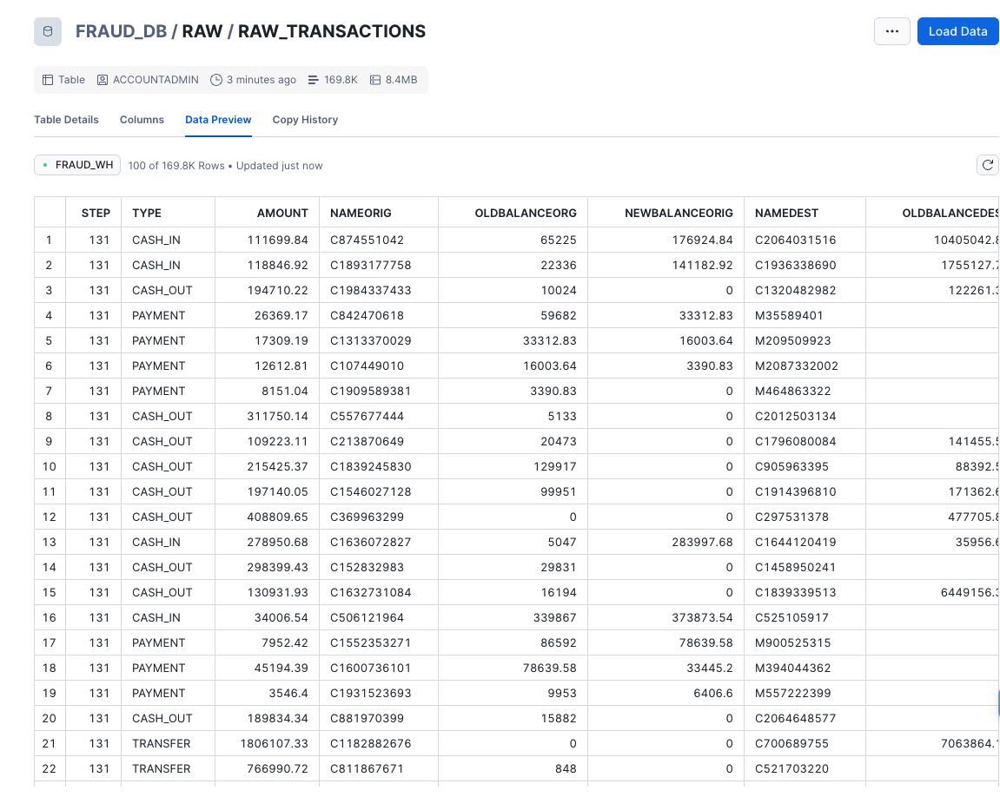

---

### 3. Staging — dbt Cleaning & Typing

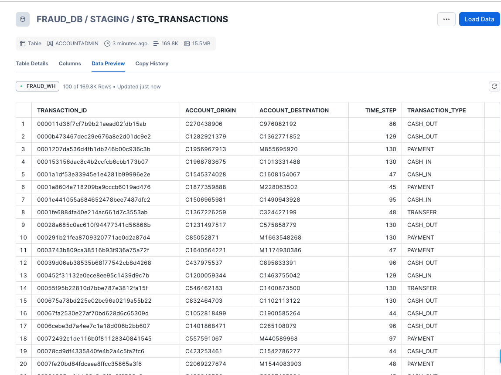

`stg_transactions` runs as an **incremental merge** on top of `RAW.raw_transactions`:

- Renames all columns to `snake_case` business-friendly names
- Casts types (`isfraud → is_fraud::boolean`)
- Generates a **surrogate key** via `dbt_utils.generate_surrogate_key`
- Computes balance deltas: `orig_balance_delta`, `dest_balance_delta`
- Deduplicates using `QUALIFY ROW_NUMBER()` window function
- Watermark logic: only processes rows newer than `max(_kitchen_ingestion_timestamp) - 5 min`

---

### 4. Trusted — dbt Dimensional Model

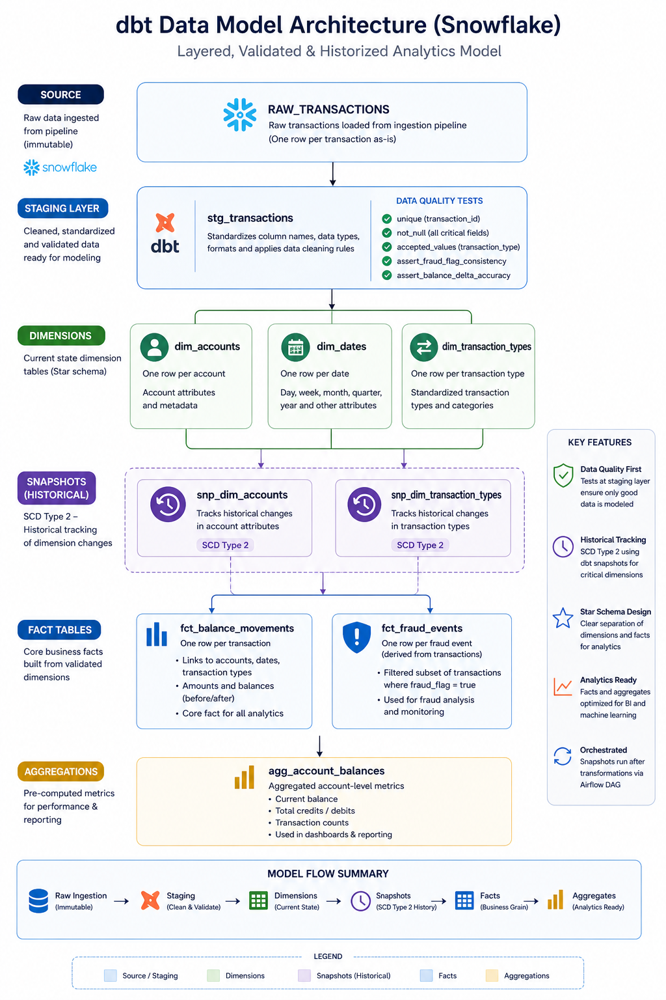

The trusted layer materialises a classic **star schema** optimised for fraud analytics:

#### Dimensions

| Model | Description |
|---|---|
| `dim_accounts` | All unique account IDs (origin + destination) |
| `dim_transaction_types` | Lookup table: PAYMENT, TRANSFER, CASH_OUT, DEBIT, CASH_IN |
| `dim_dates` | Calendar dimension with day, month, quarter, year |

#### Facts & Aggregates

| Model | Description |
|---|---|
| `fct_fraud_events` | One row per fraud/flagged transaction with fraud classification (true_positive, false_negative, false_positive) |
| `fct_balance_movements` | Full balance movement history — amount, before/after balances for origin & destination |
| `agg_account_balances` | Account-level balance summary: total transacted, fraud exposure |

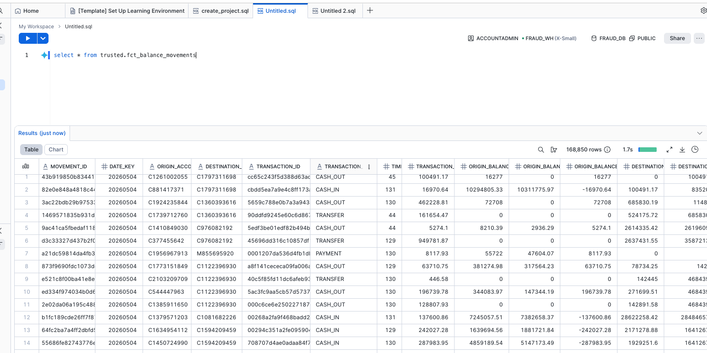
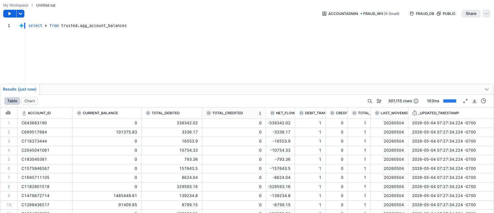

#### SCD Type 2 Snapshots

`dbt snapshot` tracks historical changes on dimension tables (`dim_accounts`, `dim_transaction_types`) into the `SNAPSHOTS` schema using dbt's built-in `check` strategy.

---

## 📊 Data Model


---

## ⚙️ Orchestration

The `paysim_batch_ingestion` Airflow DAG orchestrates the full pipeline end-to-end:


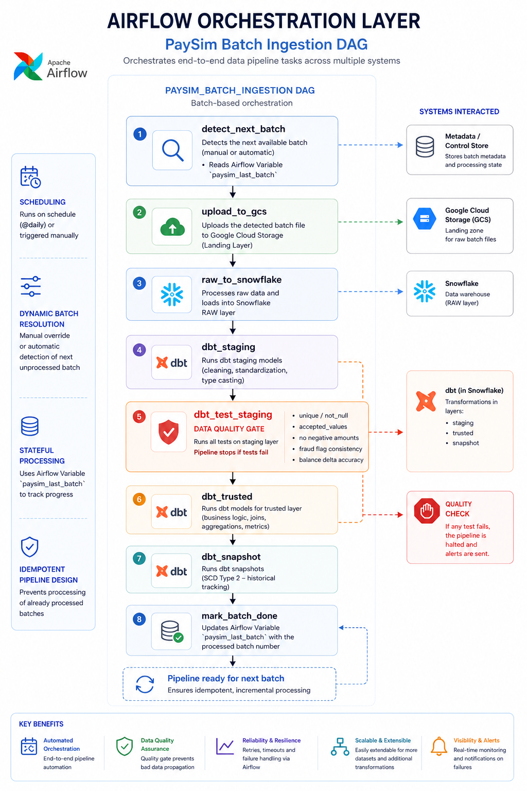


**Batch state management**: The DAG uses an Airflow Variable (`paysim_last_batch`) to track progress. On each run it automatically detects the next unprocessed batch, or accepts an explicit `batch_filename` via `dag_run.conf` for manual backfills.

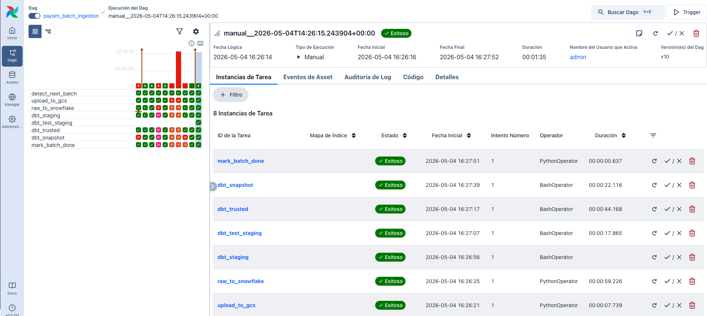

---

## ✅ Data Quality

Quality is enforced at **two independent layers**:

### Spark Layer (pre-load)
- Bad records are quarantined to `gs://<bucket>/landing/error/` via Spark's native `badRecordsPath`
- Schema is validated against `DataParameters` before writing to Snowflake

### dbt Layer (post-transform)
The `dbt_test_staging` task acts as a **hard quality gate** — the pipeline halts before trusted layer population if any test fails.

Tests implemented:

| Test | Model | Column |
|---|---|---|
| `unique` + `not_null` | `stg_transactions` | `transaction_id` |
| `not_null` | `stg_transactions` | `account_origin`, `transaction_amount`, `is_fraud` |
| `accepted_values` | `stg_transactions` | `transaction_type` (PAYMENT, TRANSFER, CASH_OUT, DEBIT, CASH_IN) |
| `assert_no_negative_amounts` | `stg_transactions` | `transaction_amount`, `orig_balance_before`, `dest_balance_before` |
| `relationships` | `fct_fraud_events` | FK → `dim_accounts`, `dim_dates`, `dim_transaction_types` |

---

## 🏛 Infrastructure

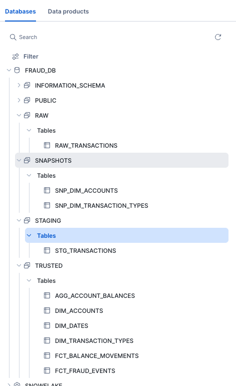

#### Snowflake Objects

```sql
-- Warehouse
FRAUD_WH    (XSMALL, auto_suspend=60s, auto_resume=true)

-- Database
FRAUD_DB

-- Schemas
FRAUD_DB.RAW          ← PySpark writes raw CSV data here
FRAUD_DB.STAGING      ← dbt staging views
FRAUD_DB.TRUSTED      ← dbt dimension & fact tables
FRAUD_DB.SNAPSHOTS    ← SCD Type 2 history tables
```

#### Terraform

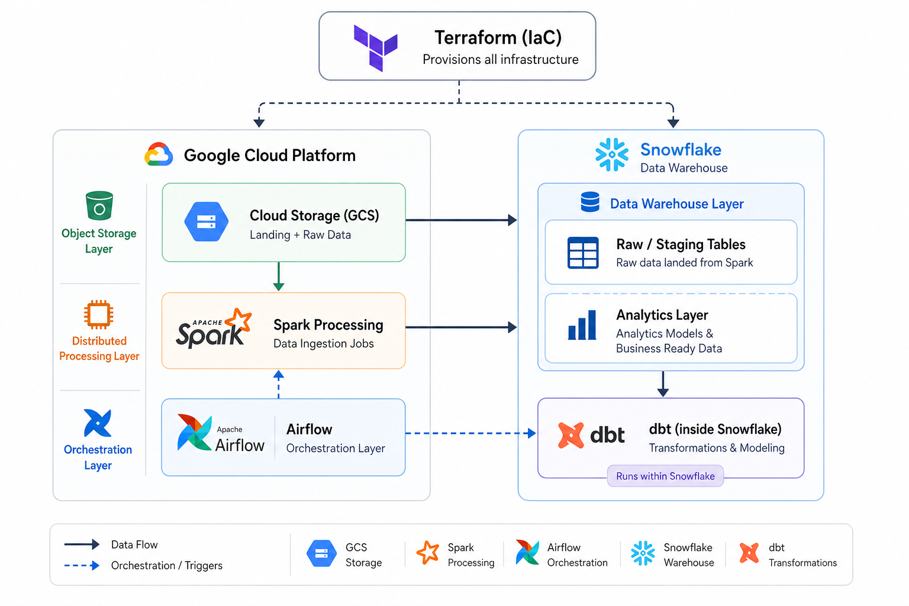

Infrastructure-as-Code for:
- GCS bucket creation with lifecycle rules (landing/incoming → processed → archived)
- GCP Service Account with least-privilege IAM bindings
- Snowflake resource provisioning

---

## 📁 Project Structure

```
paysim-fraud-analytics-platform/
│
├── ingestion/                        ← Python ELT layer
│   ├── clients/
│   │   ├── gcp.py                    ← GCS bucket client
│   │   ├── snowflake.py              ← Snowflake Spark options builder
│   │   └── spark_builder.py          ← SparkSession factory
│   ├── config/                       ← Settings & .env loader
│   ├── core/
│   │   ├── landing/                  ← upload_to_gcs.py
│   │   └── raw/
│   │       └── gcp_data_reader.py    ← GCPDataReader: GCS → Snowflake
│   ├── jobs/
│   │   ├── landing/                  ← upload_batch_to_gcs.py (Airflow-callable)
│   │   └── raw/                      ← raw_transactions.py (main Spark job)
│   ├── jars/                         ← GCS Hadoop connector JAR
│   └── data_parameters.py            ← DataParameters dataclass (schema contract)
│
├── transform/                        ← dbt project (fraud_detection_dbt)
│   ├── models/
│   │   ├── staging/                  ← stg_transactions (incremental)
│   │   ├── dimensions/               ← dim_accounts, dim_dates, dim_transaction_types
│   │   └── facts/                    ← fct_fraud_events, fct_balance_movements, agg_account_balances
│   ├── snapshots/dimensions/         ← SCD Type 2 on dim_accounts & dim_transaction_types
│   ├── tests/                        ← Custom singular tests
│   ├── macros/                       ← generate_schema_name
│   ├── dbt_project.yml
│   └── profiles.yml
│
├── orchestration/                    ← Airflow (Astronomer Runtime)
│   └── dags/
│       └── paysim_batch_ingestion.py ← Full pipeline DAG
│
├── infra/
│   ├── snowflake/                    ← DDL & warehouse setup
│   └── terraform/                    ← IaC (planned)
│
├── dataset/
│   ├── paysim_log.csv                ← Full PaySim source (6.3M rows)
│   └── batches_output/               ← 31 pre-split CSV batches
│
├── tests/                            ← Python unit tests
├── Dockerfile                        ← Astronomer Runtime image
├── requirements.txt
└── .github/workflows/                ← CI/CD (planned)
```

---

## 🚀 How to Run Locally

### Prerequisites

- Python 3.11
- Java 11+ (for PySpark)
- [Astronomer CLI](https://www.astronomer.io/docs/astro/cli/install-cli) (`astro`)
- A GCP project with a GCS bucket and a service account key (`secrets/fraud-loader-key.json`)
- A Snowflake account

### 1. Clone & configure environment

```bash
git clone https://github.com/<your-username>/paysim-fraud-analytics-platform.git
cd paysim-fraud-analytics-platform

cp .env.example .env
# Fill in your GCP_BUCKET, Snowflake credentials, etc.
```

### 2. Install Python dependencies

```bash
pip install -r requirements.txt
pip install -r requirements-dev.txt
```

### 3. Set up Snowflake

```sql
-- Run infra/snowflake/snowflake_config.sql in your Snowflake worksheet
-- Creates: FRAUD_WH, FRAUD_DB, RAW / STAGING / TRUSTED / SNAPSHOTS schemas
```

### 4. Install dbt packages

```bash
cd transform
dbt deps
```

### 5. Start Airflow (Astronomer)

```bash
export AIRFLOW_HOME=../paysim-fraud-analytics-platform/airflow
astro dev start
# Airflow UI → http://localhost:8080  (admin / admin)
```

### 6. Trigger the pipeline

**Option A — Airflow UI:**  
Trigger `paysim_batch_ingestion` with optional config:
```json
{ "batch_filename": "batch_0001_161501rows.csv" }
```

**Option B — CLI:**
```bash
astro dev run airflow dags trigger paysim_batch_ingestion
```

### 7. Run dbt manually

```bash
cd transform
export $(grep -v '^#' ../.env | xargs)
dbt run --profiles-dir .
dbt test --profiles-dir .
dbt snapshot --profiles-dir .
```

---

## 🎯 Design Decisions

| Decision | Rationale |
|---|---|
| **PySpark over Pandas** | The PaySim dataset has 6.3M rows. Spark's distributed read handles large files efficiently and mirrors production ingestion patterns at scale. |
| **GCS as landing zone** | Decouples file arrival from processing. Files accumulate in `landing/incoming/` and are processed in ordered batches, enabling replay and auditing. |
| **Incremental dbt models** | Avoids full table scans on every run. Watermark logic (`_kitchen_ingestion_timestamp - 5 min`) prevents gaps during concurrent loads. |
| **Surrogate keys via `dbt_utils`** | Natural keys in PaySim are not globally unique. Surrogate keys built from composite business attributes ensure idempotent merges. |
| **SCD Type 2 snapshots** | Captures account dimension changes over time — essential for accurate point-in-time fraud analysis. |
| **Airflow Variable for batch state** | Simple, observable state management. Variables are visible in the Airflow UI and can be manually overridden for backfills. |
| **dbt test as quality gate** | Placing `dbt_test_staging` between the staging and trusted tasks ensures bad data never reaches downstream models. |
| **Medallion architecture** | Raw → Staging → Trusted separation enforces single responsibility per layer and makes debugging straightforward. |

---

## 🗺 Roadmap

- [ ] **GitHub Actions CI** — `dbt compile` + `dbt test` + `ruff` lint on every PR
- [ ] **Streamlit dashboard** — fraud rate over time, loss by transaction type, precision/recall of fraud flag
- [ ] **Row-count drift alerts** — Airflow callback if ingested rows deviate >20% from rolling average
- [ ] **dbt docs site** — hosted dbt documentation with full lineage graph
- [ ] **mart layer** — `mart_fraud_summary` pre-aggregated for BI consumption

---

## 📄 Dataset

This project uses the **[PaySim1 dataset](https://www.kaggle.com/datasets/ealaxi/paysim1)** — a synthetic financial transaction simulator based on real mobile money transaction patterns.

| Attribute | Value |
|---|---|
| Total rows | ~6.3 million |
| Batches | 31 CSV files |
| Fraud rate | ~0.13% |
| Transaction types | PAYMENT, TRANSFER, CASH_OUT, DEBIT, CASH_IN |
| Fraud types | TRANSFER, CASH_OUT only |

---

<p align="center">
  Built with ❤️ as a portfolio project · <a href="https://www.linkedin.com/in/selene-andrade">LinkedIn</a>
</p>

